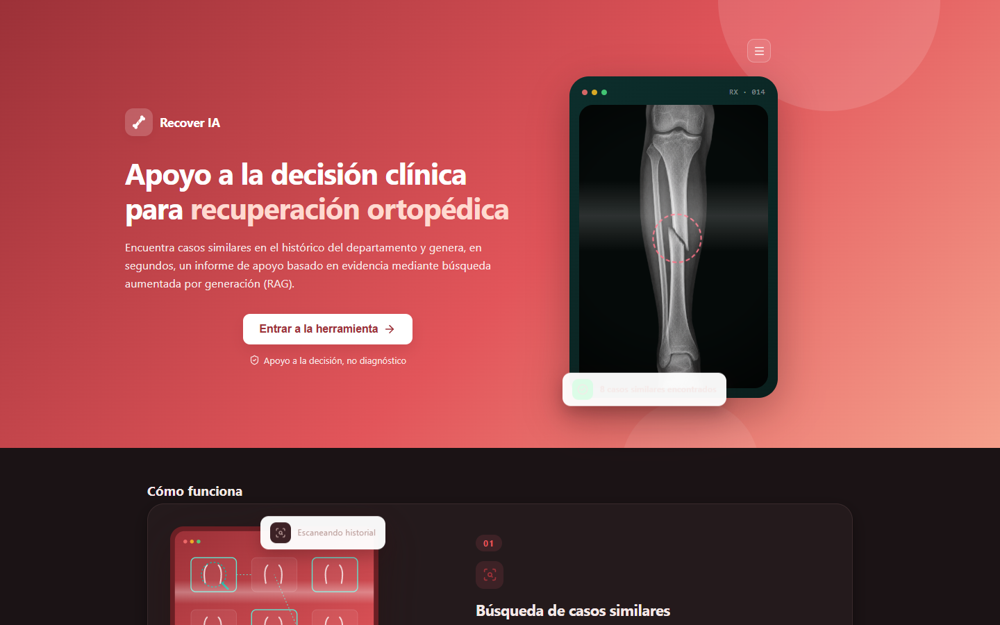
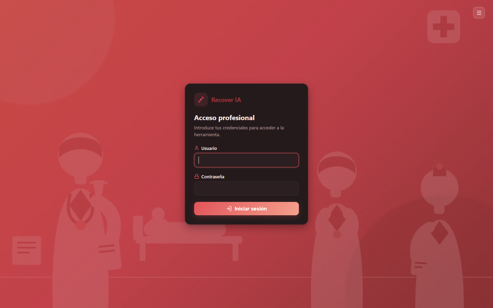
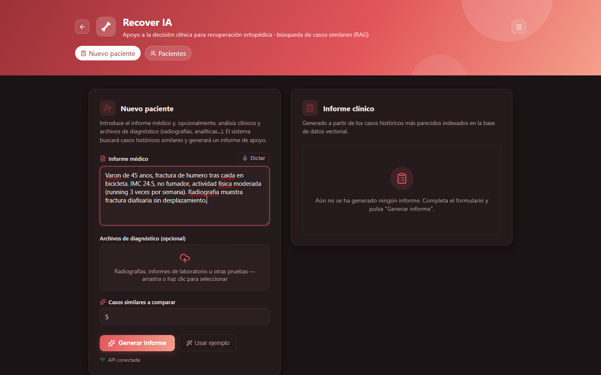

# recovery-ia

Sistema RAG de apoyo a la decisión clínica para planificación de recuperación ortopédica: recupera casos históricos similares (radiografías, informes diagnósticos, análisis clínicos y atributos del paciente) y genera un informe con tratamiento, tiempo de recuperación, dieta y hábitos de salud recomendados.

Ver [requirements.md](requirements.md) para la propuesta original, y [docs/architecture.md](docs/architecture.md) para el diagrama de arquitectura.

**Stack**: base de datos vectorial (casos históricos) + orquestación RAG + Claude (LLM) + FastAPI (backend) + MongoDB (persistencia de resultados de salida) + React/Vite (frontend) + uv (gestión del entorno Python) + Docker.

## Capturas de pantalla

| Landing                                  | Acceso profesional                   |
| ---------------------------------------- | ------------------------------------ |
|  |  |

| Nuevo paciente + informe clínico             |
| -------------------------------------------- |
|  |

## Estructura del proyecto

```
recovery-ia/
├── requirements.md                         # propuesta original
├── docs/
│   └── architecture.md                    # diagrama y descripción de la arquitectura
├── data/
│   ├── raw/                                # dataset de casos historicos (generado por herramienta externa)
│   ├── kaggle_raw/                          # dataset de rayos X de Kaggle (descarga manual, gitignored)
│   ├── xray_images/                         # radiografias reales organizadas por tipo de fractura (gitignored)
│   ├── uploads/                             # archivos subidos via /cases/report (gitignored)
│   ├── qdrant_storage/                      # volumen persistente de la base de datos vectorial (gitignored)
│   └── mongo_data/                          # volumen persistente de MongoDB (gitignored)
├── scripts/
│   ├── generate_synthetic_data.py          # generador de dataset sintetico de respaldo
│   ├── import_kaggle_xrays.py              # organiza las radiografias reales de Kaggle por tipo de fractura
│   └── ingest_vector_db.py                 # embebe e indexa los casos historicos en la base de datos vectorial
├── src/recovery_ia/
│   ├── config/                             # settings (.env)
│   ├── schemas/                            # modelos Pydantic (PatientCase, queries, informe, registro de resultados)
│   ├── embeddings/                         # embedder de texto e imagen (pendiente)
│   ├── vectorstore/                        # cliente de base de datos vectorial
│   ├── retrieval/                          # búsqueda por similitud + filtros estructurados
│   ├── agent/                              # extraccion de informe + pipeline de retrieval + LLM
│   ├── storage/                            # cliente MongoDB (persistencia de resultados de salida)
│   └── api/                                # FastAPI: /cases/similar, /cases/report, /cases/reports
├── frontend/                                # UI React + Vite servida en :8080
│   └── src/
│       ├── App.jsx
│       └── components/
├── tests/
├── Dockerfile                               # imagen del backend (FastAPI)
├── docker-compose.yml                       # base de datos vectorial + MongoDB + backend
├── pyproject.toml
└── .env.example
```

## Puesta en marcha

El entorno Python se gestiona con [uv](https://docs.astral.sh/uv/) (crea y sincroniza `.venv` a partir de `pyproject.toml`/`uv.lock`).

### Opción A: todo en Docker

```bash
copy .env.example .env   # y rellenar ANTHROPIC_API_KEY
docker compose up -d --build   # base de datos vectorial + MongoDB + backend (API en :8000)
```

### Opción B: backend en local con uv

```bash
# 1. Entorno
uv sync --extra dev
copy .env.example .env   # y rellenar ANTHROPIC_API_KEY

# 2. Base de datos vectorial + MongoDB
docker compose up -d qdrant mongo

# 3. Dataset historico en data/raw/patients.json (generado por la herramienta externa)
#    y, opcionalmente, radiografias reales: ver data/kaggle_raw/README.md
uv run scripts/import_kaggle_xrays.py

# 4. Indexar en la base de datos vectorial
uv run scripts/ingest_vector_db.py

# 5. Levantar la API (puerto 8000)
uv run uvicorn recovery_ia.api.main:app --reload
```

### Frontend (ambas opciones)

```bash
cd frontend
npm install
npm run dev   # puerto 8080
```

Con la API y el frontend en marcha, abre **http://localhost:8080**. Tests del backend: `uv run pytest`.

## API

- `POST /cases/similar` — devuelve los casos más parecidos sin pasar por el LLM.
- `POST /cases/report` (multipart: `medical_report_text`, `lab_results_text` opcional, `xray` opcional, `additional_files` opcional, `top_k`) — ejecuta el pipeline completo (extracción → recuperación vectorial → LLM) y devuelve el informe clínico (tratamiento, tiempo de recuperación, dieta y hábitos de salud). El resultado se archiva en MongoDB.
- `GET /cases/reports` / `GET /cases/reports/{id}` — histórico de informes generados, leído de MongoDB.

## Sobre los datos

- **Dataset de casos históricos** (`data/raw/patients.json`): datos de pacientes **sintéticos/inventados**, generados por una herramienta externa (o, como respaldo, por `scripts/generate_synthetic_data.py`). Sin ningún dato de paciente real. Cada caso incluye diagnóstico, demografía y una analítica (calcio, vitamina D, hemoglobina, glucosa, PCR) con desviaciones realistas según comorbilidades y gravedad.
- **Radiografías** (`data/xray_images/`): opcionalmente, imágenes reales del dataset público de Kaggle ["Bone Fracture Multi-Region X-ray Data"](https://www.kaggle.com/datasets/bmadushanirodrigo/fracture-multi-region-x-ray-data), organizadas por `scripts/import_kaggle_xrays.py`. No se redistribuyen en este repositorio (ver `data/kaggle_raw/README.md`); solo aportan la imagen, los datos clínicos del paciente siguen siendo sintéticos.
- **Resultados de salida** (MongoDB): cada informe generado por `/cases/report`, junto con la entrada del paciente y los casos similares usados, para dejar constancia de cada consulta.

Antes de conectar historiales reales anonimizados, hará falta además una revisión de cumplimiento (RGPD/datos de salud).
