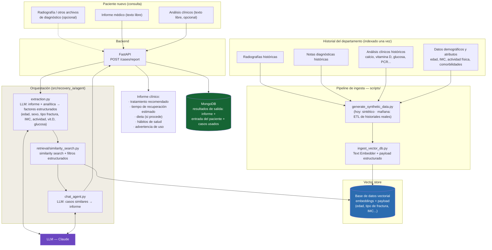

# Arquitectura — recovery-ia

Sistema RAG de apoyo a la decisión clínica: dado un paciente nuevo (rayos X, informe médico y análisis clínicos), recupera casos ortopédicos históricos similares y genera un informe con tratamiento, tiempo de recuperación, dieta y hábitos de salud recomendados.

## Diagrama

## Flujo

1. **Ingesta (offline, una vez)**: los historiales del departamento (imagen + notas diagnósticas + análisis clínicos + datos estructurados) se embeben y se indexan en la **base de datos vectorial** junto con un payload estructurado (edad, tipo de fractura, IMC, comorbilidades, valores de analítica) usado como filtro. Hoy este historial es el dataset sintético de `data/raw/`.
2. **Entrada del paciente nuevo**: el profesional envía a `POST /cases/report` el informe médico en texto libre, opcionalmente los análisis clínicos (también texto libre) y opcionalmente archivos de diagnóstico (radiografía, informes de laboratorio en PDF, etc. — se guardan y referencian, pero de momento solo el texto alimenta la búsqueda; ver limitación más abajo).
3. **Extracción**: el LLM lee el informe + analítica y extrae los factores estructurados (edad, sexo, tipo de fractura, IMC, actividad física, vitamina D, glucosa) — `src/recovery_ia/agent/extraction.py`. No se inventan valores que no estén en el texto.
4. **Recuperación**: el sistema combina búsqueda semántica sobre el texto combinado (informe + analítica) con los filtros estructurados extraídos, y recupera los 5–10 casos más similares de la base de datos vectorial.
5. **Generación del informe**: el LLM recibe esos casos como contexto y redacta el informe final: resumen de casos similares, tratamiento recomendado, tiempo de recuperación estimado, dieta (solo si aplica) y hábitos de salud recomendados, más una advertencia de que es apoyo a la decisión y no sustituye el criterio clínico.
6. **Persistencia del resultado**: cada informe generado, junto con la entrada del paciente y los casos similares usados como contexto, se archiva como un documento en **MongoDB** (`src/recovery_ia/storage/`). Es el histórico de "resultados de salida" del sistema — no el dataset de entrenamiento/indexación, que vive en la base de datos vectorial.
7. **Canales opcionales**: Telegram/WhatsApp/Discord como capa de mensajería adicional sobre el mismo backend (fase 2, fuera del alcance del MVP).

> **Limitación actual**: los archivos binarios (radiografías, PDFs de laboratorio) se guardan en `data/uploads/` y se referencian en `NewPatientInput`, pero su contenido no se procesa todavía — el embedding de imagen está pendiente de elegir modelo (`src/recovery_ia/embeddings/image_embedder.py`). Hoy toda la señal viene del texto (`medical_report_text` + `lab_results_text`).

## Componentes ↔ código

| Componente | Carpeta / archivo |
|---|---|
| Generación/ingesta de datos históricos | `scripts/generate_synthetic_data.py`, `scripts/ingest_vector_db.py` |
| Cliente de base de datos vectorial | `src/recovery_ia/vectorstore/` |
| Embeddings texto/imagen | `src/recovery_ia/embeddings/` |
| Entrada cruda del paciente (informe + analítica + archivos) | `src/recovery_ia/schemas/query.py` (`NewPatientInput`) |
| Informe + analítica → consulta estructurada | `src/recovery_ia/agent/extraction.py` |
| Retriever + filtros estructurados | `src/recovery_ia/retrieval/` |
| Consulta → informe clínico final | `src/recovery_ia/agent/chat_agent.py` |
| Modelo del informe (tratamiento, recuperación, dieta, hábitos) | `src/recovery_ia/schemas/report.py` |
| Persistencia de resultados (MongoDB) | `src/recovery_ia/storage/mongo.py`, `src/recovery_ia/schemas/report_record.py` |
| API | `src/recovery_ia/api/routes/query.py` (`POST /cases/report`, `GET /cases/reports`) |
